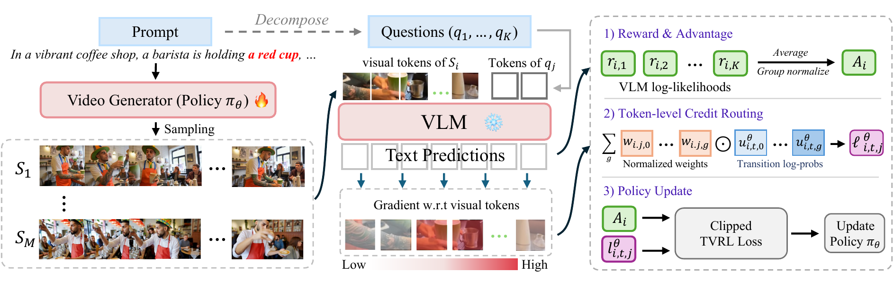

# TVRL: Token-Level Video Reinforcement Learning

**[Project page](https://yfwang1999.github.io/TVRL/)** · **Paper:** coming soon

Yifan Wang<sup>1</sup>, Gordon Guocheng Qian<sup>†</sup>, Yanyu Li, Anil Kag, Yun Fu<sup>1</sup>  
<sup>1</sup>Northeastern University · <sup>†</sup>Corresponding author

Video GRPO assigns one scalar reward to a whole video and broadcasts the resulting advantage to
every token. TVRL derives **token-level credit from the reward being optimized**: a frozen
vision-language model scores each rollout by the teacher-forced likelihood of prompt-derived
yes/no checks, and the magnitude of the same likelihood's gradient with respect to the video
input routes the group-relative advantage to the video tokens that score depends on. The VLM
gradient is detached and never reaches the generator.

<p align="center"></p>

## Results

VBench-2.0 on HunyuanVideo-1.5 with the SAGE sampler, means over three seeds, 100 optimizer steps.

| Reward model | Method | Overall | Creativity | Common sense | Control | Human | Physics |
|---|---|---|---|---|---|---|---|
| – | Base model | 54.09 | 41.40 | 62.75 | 30.26 | 88.94 | 47.11 |
| VideoAlign | GRPO | 54.18 | 41.44 | 61.14 | 30.77 | 90.06 | 47.49 |
| | **TVRL** | **55.54** | 45.11 | 61.16 | 32.09 | 90.21 | 49.15 |
| VideoScore2 | GRPO | 54.66 | 42.23 | 64.89 | 30.29 | 91.52 | 44.35 |
| | **TVRL** | **55.99** | 42.08 | 64.60 | 31.33 | 90.79 | 49.13 |
| UnifiedReward2 | GRPO | 54.82 | 42.90 | 62.14 | 30.25 | 88.90 | 50.90 |
| | **TVRL** | **56.67** | 45.36 | 64.55 | 31.29 | 89.87 | 52.28 |
| Qwen3.5-9B | GRPO | 54.54 | 41.68 | 64.88 | 31.57 | 88.85 | 45.74 |
| | **TVRL** | **57.69** | 47.36 | 64.31 | 31.64 | 90.76 | 54.37 |

Video comparisons for every figure in the paper are on the [project page](https://yfwang1999.github.io/TVRL/).

## Repository layout

```
post_train.py                         training entry point (GRPO and TVRL)
generate.py                           sampling from the base model or a checkpoint
hyvideo/                              HunyuanVideo-1.5 model, pipeline, schedulers, optimizers
hyvideo/models/reward_models/         reward models; rewards.py holds the VLM reward and token credit
hyvideo/utils/grpo_utils.py           rollouts, SDE log-probabilities, token-credit routing, losses
scripts/train_tvrl.sh                 TVRL training (Qwen3.5-9B reward, 3x3 credit, SAGE sampler)
scripts/train_grpo.sh                 matched scalar-reward GRPO baseline
scripts/generate.sh                   evaluation sampling
scripts/decompose_prompts.py          prompt -> five yes/no checks (offline)
scripts/check_decomposition.py        validates a decomposed prompt CSV
assets/train_prompts_binary5.csv      10,000 training prompts with their checks and reference answers
assets/val_prompts.csv                validation prompts used in the qualitative comparisons
assets/videogen_eval_top100.csv       VideoGen-Eval prompts used in the qualitative comparisons
tests/                                CPU regression tests for the credit-map layout
docs/                                 project page
```

## Installation

```bash
git clone https://github.com/YFWang1999/TVRL.git
cd TVRL
pip install -r requirements.txt
```

`requirements.txt` pins PyTorch 2.10 with CUDA 13.0; adjust the three `torch*` lines to your CUDA
build. `transformers` is left unpinned because the Qwen3.5 critic needs a recent release; use the
latest version.

## Checkpoints

1. HunyuanVideo-1.5 base model, text encoders, and vision encoder: follow
   [`checkpoints-download.md`](checkpoints-download.md); everything goes under `./ckpts`.
2. The frozen critic. The default is [Qwen3.5-9B](https://huggingface.co/Qwen/Qwen3.5-9B):

   ```bash
   hf download Qwen/Qwen3.5-9B --local-dir ./ckpts/Qwen3.5-9B
   ```

   Point `VLM_REWARD_MODEL_PATH` elsewhere to use another location, and set
   `VLM_REWARD_MODEL_FAMILY` to use another critic.
3. Only for the VideoAlign reward: `bash download_weights.sh`.

## Training data

`assets/train_prompts_binary5.csv` already contains the decomposed checks. Each row holds the
prompt, a seed, five yes/no sub-questions, the structured VLM query, and the all-`Yes` reference
answer used for teacher forcing. To decompose your own prompts:

```bash
python scripts/decompose_prompts.py \
  --input_csv my_prompts.csv --output_csv my_prompts_binary5.csv \
  --model_path ckpts/Qwen3.5-9B
python scripts/check_decomposition.py my_prompts_binary5.csv --fill-yes --output my_prompts_ready.csv
```

The decomposition model sees only the prompt text, never a generated video.

## Training

```bash
bash scripts/train_tvrl.sh        # TVRL: token credit routes the advantage
bash scripts/train_grpo.sh        # baseline: same reward, uniform credit
```

Both use every visible GPU. The paper's runs use 64 A100 80GB GPUs with a per-device batch of 2,
a group of 4 rollouts per prompt, 81-frame 352x624 rollouts with 20 denoising steps, and evaluate
the checkpoint after 100 optimizer steps. Common overrides:

| Variable | Default | Meaning |
|---|---|---|
| `SDE_TYPE` | `sage_grpo` | stochastic sampler: `sage_grpo`, `flow_grpo`, `dance_grpo` |
| `CREDIT_GRANULARITY` | `window` | `window` for spatial credit, `frame` for one weight per frame |
| `CREDIT_WINDOW` | `3` | smoothing window on the 16x16 routing grid (`7` coarser, `1` unsmoothed) |
| `RATIO_MODE` | `weighted_logprob` | `uniform_weighted_logprob` turns routing off |
| `VLM_REWARD_MODEL_PATH` | `./ckpts/Qwen3.5-9B` | frozen critic |
| `MAX_STEPS` / `SAVE_INTERVAL` | `100` / `25` | optimizer steps and checkpoint interval |
| `ENABLE_WANDB` | `False` | set `True` and export `WANDB_API_KEY` to log to Weights & Biases |

Checkpoints are written to `outputs/<run>/checkpoints/checkpoint-<step>/transformer`.

The token-credit path is selected by `--reward_model vlm_reward --vlm_reward_score_type token_credit`.
The relevant options in `post_train.py` are `--token_credit_loss_mode` (`video_adv` shares one
rollout advantage across checks), `--token_credit_ratio_mode`, and the
`--token_credit_spatial_*` options.

## Sampling and evaluation

```bash
bash scripts/generate.sh                                                        # base model
CHECKPOINT_PATH=outputs/<run>/checkpoints/checkpoint-100/transformer \
  RUN_NAME=<run> bash scripts/generate.sh
```

Evaluation videos are 121 frames at 480x864 with 40 denoising steps. We score them with the
official [VBench-2.0](https://github.com/Vchitect/VBench) toolkit.

## Tests

```bash
python -m unittest discover -s tests
```

## Acknowledgements

This code builds on [SAGE-GRPO](https://arxiv.org/abs/2603.21872) and
[HunyuanVideo-1.5](https://arxiv.org/abs/2511.18870), and the training prompts
come from the public SAGE-GRPO prompt set. The stochastic samplers follow
[Flow-GRPO](https://arxiv.org/abs/2505.05470), [DanceGRPO](https://arxiv.org/abs/2505.07818), and
SAGE-GRPO. Reward models: [VideoAlign](https://arxiv.org/abs/2501.13918),
[VideoScore2](https://arxiv.org/abs/2509.22799), UnifiedReward, and Qwen3.5.

## License

The code derives from HunyuanVideo-1.5 and is distributed under the
[Tencent Hunyuan Community License](LICENSE), including its territorial restrictions. The
pretrained models and reward models keep their own licenses.

## Citation

BibTeX will be added once the paper is available.
